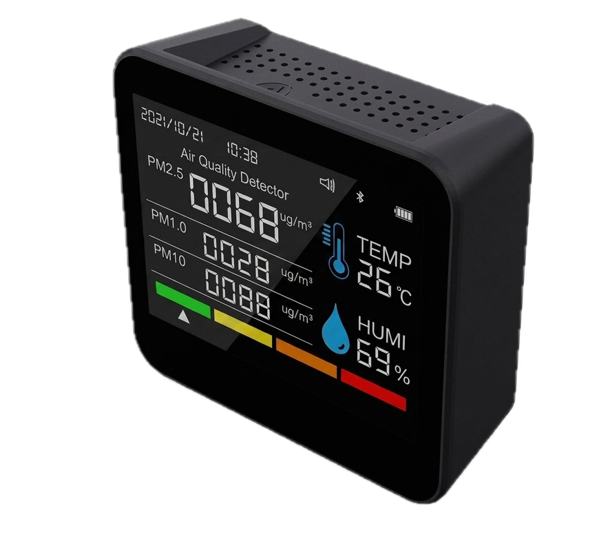
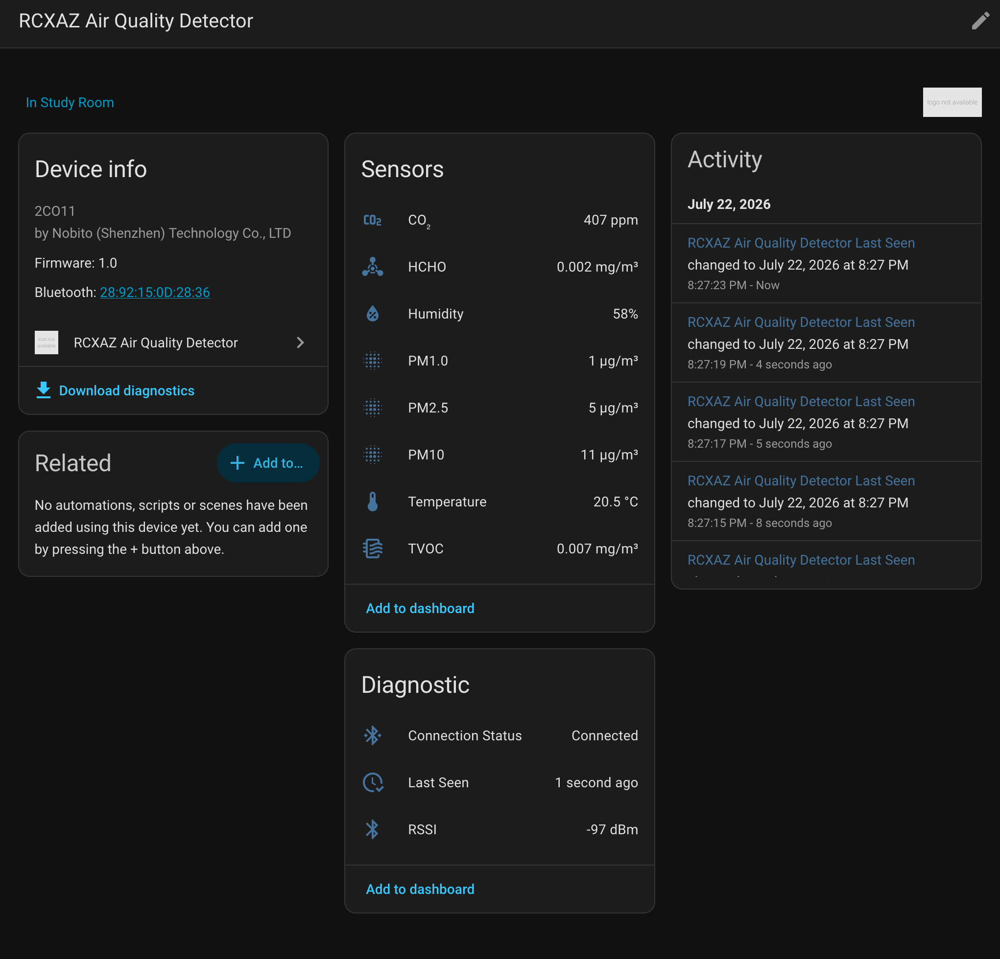

# RCXAZ Air Quality Detector — Home Assistant Integration

A [HACS](https://hacs.xyz) custom integration that brings the **RCXAZ Air Quality Detector** into Home Assistant. It uses HA's native Bluetooth APIs, so both the built-in adapter **and** [ESPHome Bluetooth proxies](https://esphome.io/components/bluetooth_proxy.html) work out of the box.

   

      
The device measures temperature, humidity, CO₂, TVOC, formaldehyde (HCHO), and particulate matter (PM1.0, PM2.5, PM10), pushing data via BLE notifications at ~1 Hz.

   

   

      
   

   

      
Home Assistant integration showing sensor entities for the RCXAZ Air Quality Detector.

   

   

      
   

---

## Entities

| Entity | Type | Description |
|---|---|---|
| Temperature | Sensor | Current temperature in °C |
| Humidity | Sensor | Current relative humidity in % |
| CO₂ | Sensor | Carbon dioxide concentration in ppm |
| TVOC | Sensor | Total Volatile Organic Compounds in mg/m³ |
| HCHO | Sensor | Formaldehyde concentration in mg/m³ |
| PM1.0 | Sensor | Particulate matter <1.0 µm in µg/m³ |
| PM2.5 | Sensor | Particulate matter <2.5 µm in µg/m³ |
| PM10 | Sensor | Particulate matter <10 µm in µg/m³ |
| Connection Status | Sensor *(diagnostic)* | `Connected` / `Connecting` / `Disconnected` |
| Signal Strength | Sensor *(diagnostic)* | RSSI in dBm |
| Last Seen | Sensor *(diagnostic)* | Timestamp of the most recent reading |

---

## Requirements

- Home Assistant 2024.1 or later (tested on 2026.6.3)
- A Bluetooth adapter accessible to HA (built-in, USB dongle, or [ESPHome Bluetooth proxy](https://esphome.io/components/bluetooth_proxy/))
- RCXAZ Air Quality Detector (model 2CO11), powered on with Bluetooth enabled

---

## Installation

### Via HACS (recommended)

1. Open HACS → **Integrations** → ⋮ → **Custom repositories**.
2. Add this repository URL and select category **Integration**.
3. Search for **RCXAZ Air Quality Detector** and click **Download**.
4. Restart Home Assistant.

### Manual

Copy the `custom_components/rcxaz_air_quality/` folder into your HA `config/custom_components/` directory and restart Home Assistant.

---

## Configuration

1. Power on the detector and enable Bluetooth.
2. Go to **Settings → Devices & Services** in Home Assistant.
3. A discovered **XS-**** notification will appear — click **Configure**.
   - If auto-discovery does not appear, click **+ Add Integration**, search for *RCXAZ Air Quality*, and enter the Bluetooth MAC address manually.

The device pushes sensor data autonomously — no polling interval to configure.

---

## Tested devices

| Model | Description | Year of Purchase |
|---|---|---|
| 2CO11 | 9-in-1, BLE | 2026 |

---

## Diagnostics

To help troubleshoot issues, open the device page and click **Download diagnostics**. The downloaded JSON contains connection state, last reading, signal strength, and other debug info — the MAC address is redacted automatically.

---

## **⚠️ Disclaimer**

> This is a personal hobby project. I am not affiliated with, endorsed by, or in any way connected to the manufacturer of this device. The BLE protocol was reverse-engineered from packet captures and may break with firmware updates. **Use at your own risk — no warranty of any kind is provided.**

---

For contributor and developer information see [DEVELOPMENT.md](DEVELOPMENT.md).
